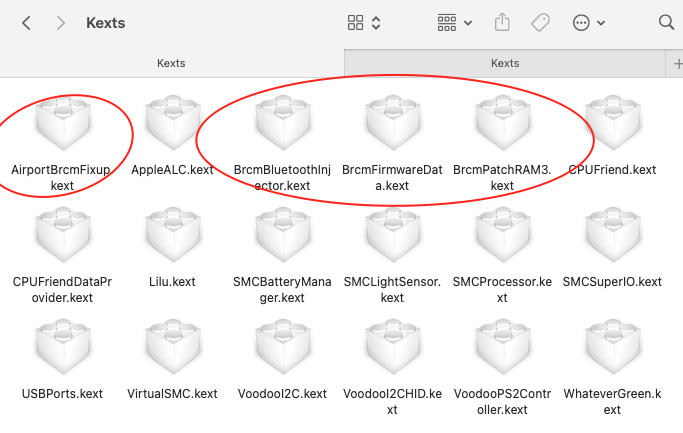
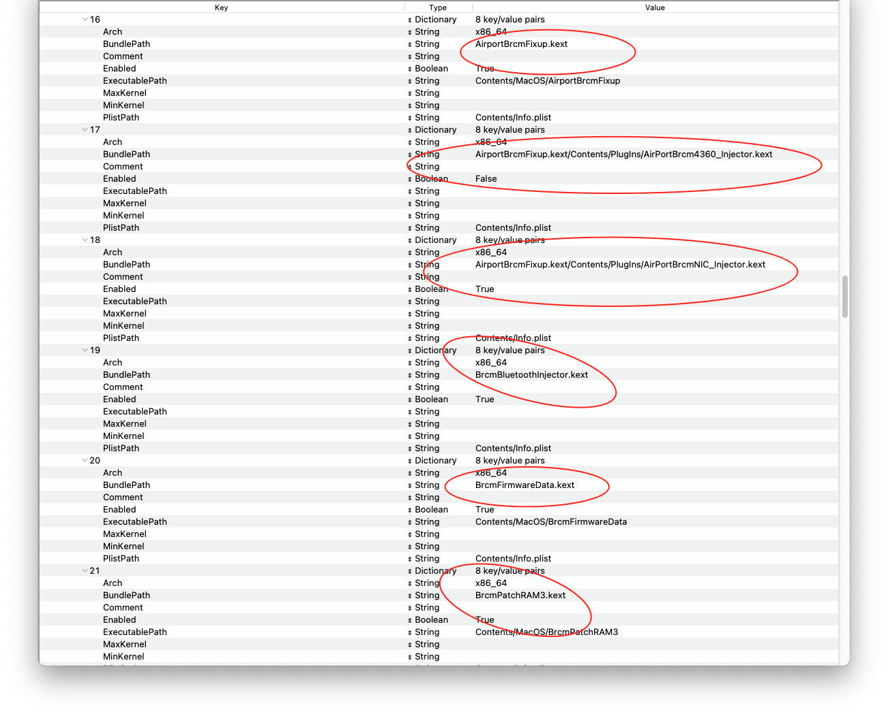
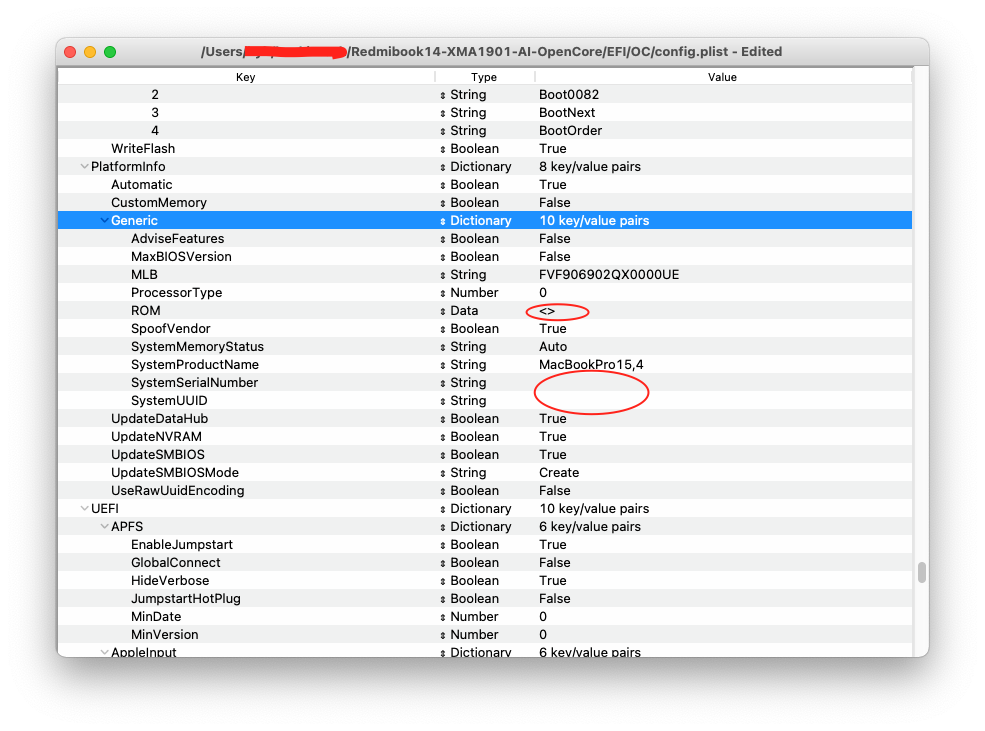
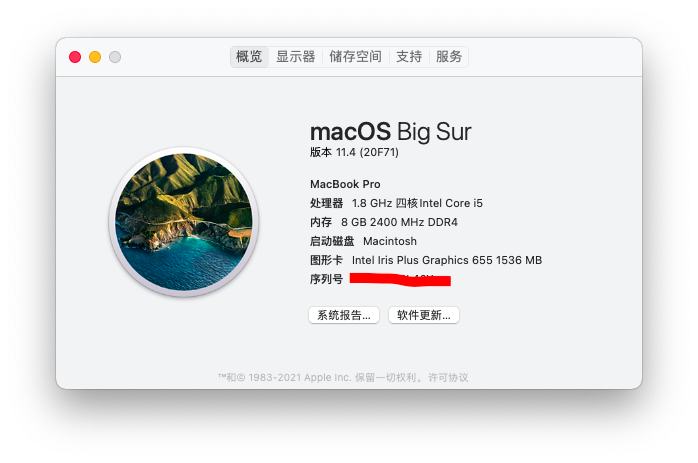

# RedmiBook 14 XMA1901-AI-OpenCore

--

硬件|型号
--|:--:
CPU|i5-8250U @1.6GHz 4核(Whiskey Lake-U)
内存|三星8G
存储|金士顿SSD 256G
集成显卡|intel UHD 620 Whiskey Lake-U GT2
独立显卡|nvidia mx250
无线网卡|intel 9462NGW
声卡|Realtek 256 + intel智音技术

## 工作:
集成显卡&radic;

hdmi输出&radic;

声音输出(支持耳机)&radic;

睡眠&radic;

触摸板i2C&radic;

wifi&radic;

## 不工作:

麦克风&times;

蓝牙&times;

## 安装镜像

[黑果小兵](https://blog.daliansky.net/macOS-BigSur-11.4-20F71-Release-version-with-OC-0.6.9-and-Clover-5134-and-PE-original-image.html)

## 安装方法

详见黑果小兵教程、远景论坛等各大黑苹果论坛

## 注意
+ 请勿用于引导windows
+ 网卡已更换为DW1820A解决了wifi稳定性与蓝牙的问题，如果您依然使用的是intel的无线网卡，请去除EFI/OC/Kexts/下的驱动以及config.plist中的 然后使用[itlwm](https://github.com/OpenIntelWireless/itlwm)的intel驱动
+ 睡眠唤醒需要按电源键(AOAC睡眠)
+ 请把序列号信息换成你自己的

